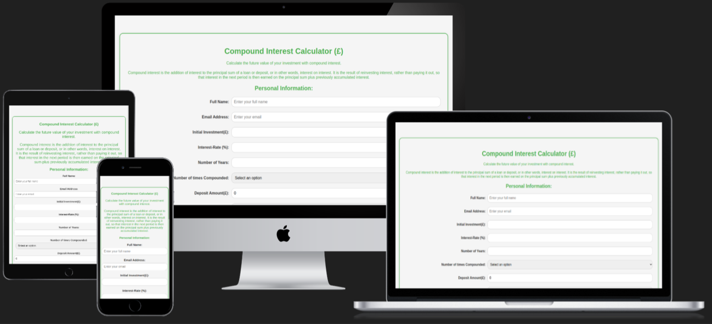
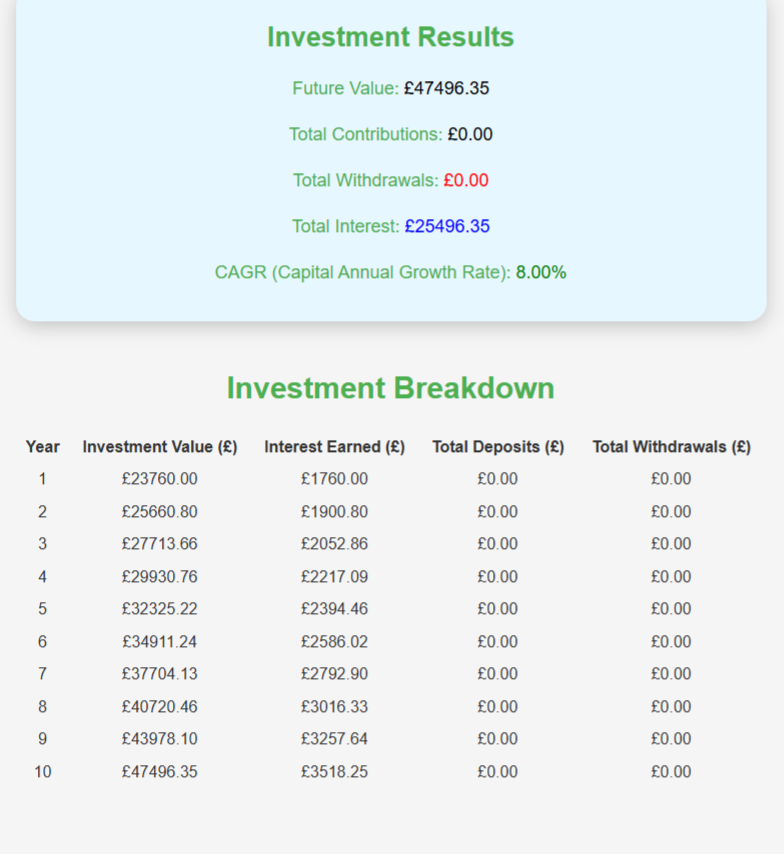
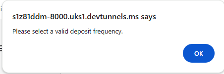
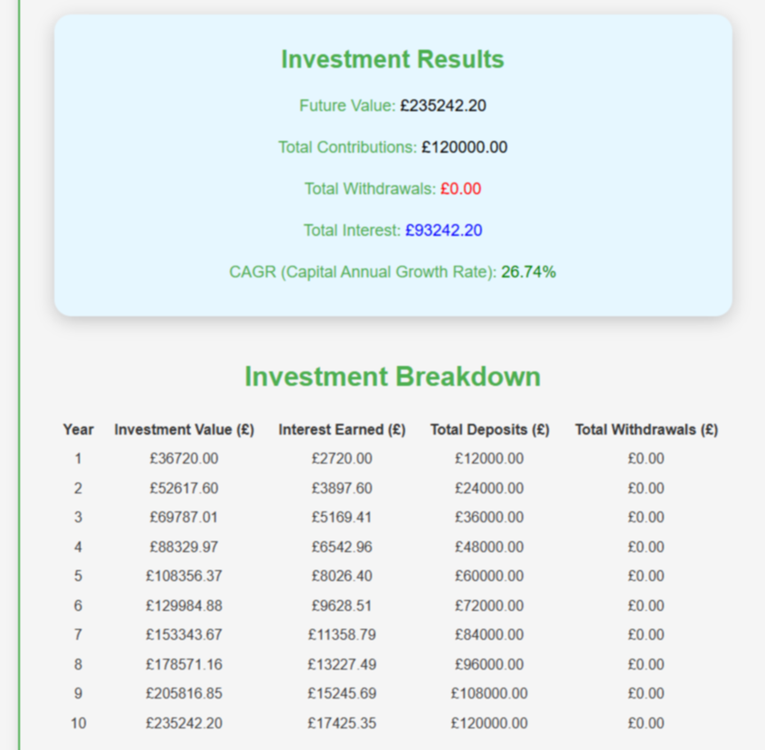
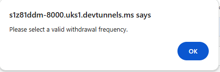
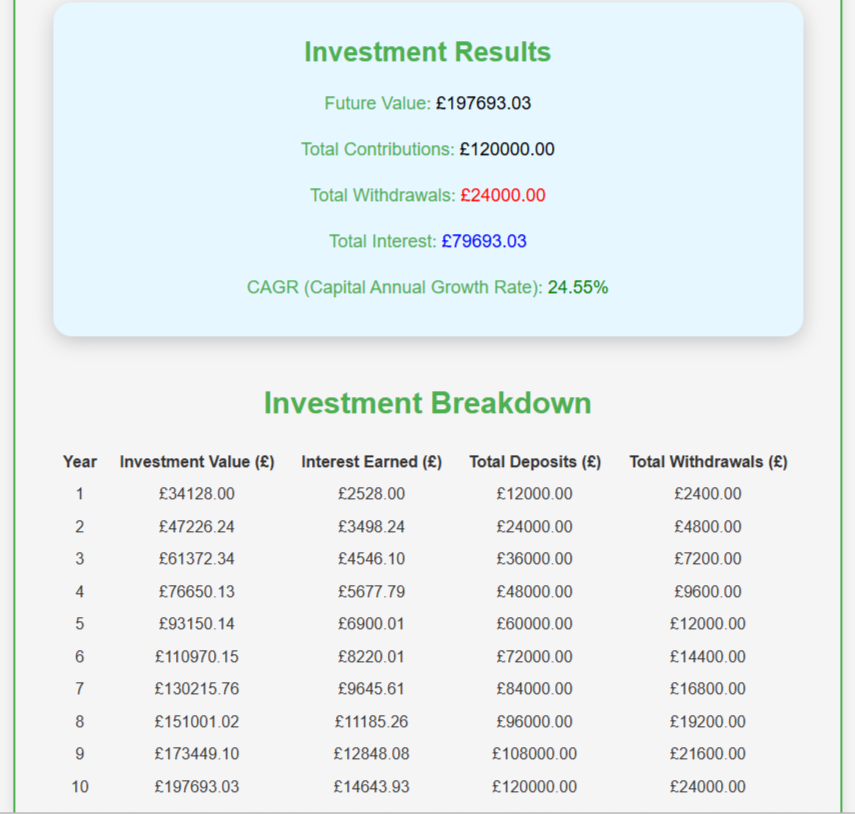
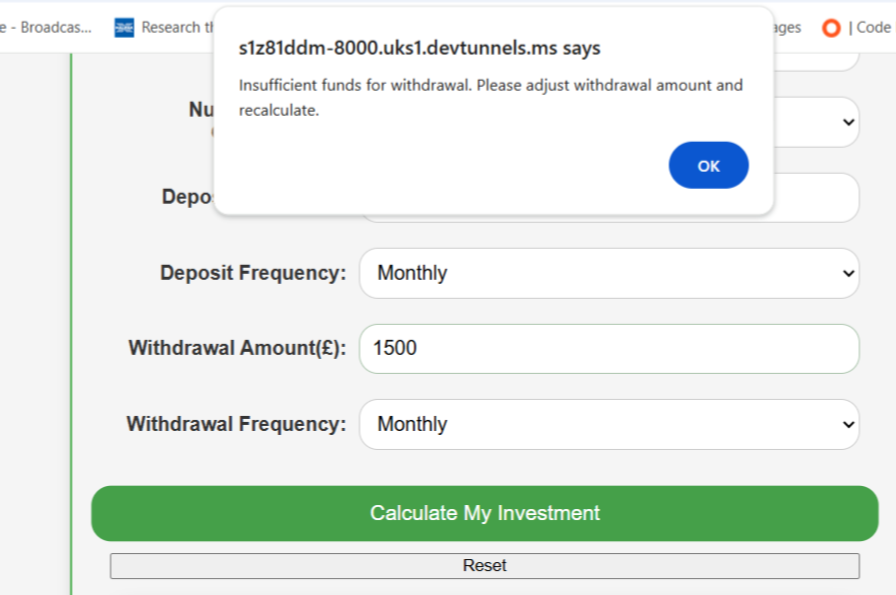

# Compound-Interest-Calculator
Calculate the value of a future investment during a fixed period, from an initial deposit with various factors and conditions  to determine the value of the future investment.

Compound Interest Calculator is a fictional application enabling all investing web users to calculate the growth of their investment with a principal amount using this tool. The primary objective of this site is to provide a clean, intuitive, simple and user friendly functionality for a residential person coming from a non-financial and non-technical background to calculate their future value should they invest their funds into a bank account, building society account, investment fund, shares or equivalent investment product of their desire which provides a return on value 

A common and typical example is an investor investing £5,000 in a high interest bank account paying at the current high rate of 4% per year. In the first year the investment would be valued at £5200. In the second year, let's assume the rate should remain the same at 4%, in year two the value of your investment would be £5408 and so on. If the trend continued for 20 years at the same rate, the future rate would be £11, 393.84. Should the value of your investment increase over a duration, this is known as compounding. 

The tool is not just limited to calculating the compounded future value using your principal investment, annual rate and duration. It also allows you to apply conditions such as the deposits made within a frequency period and withdrawals made over a frequency period and calculate the compound annual growth rate (cagr). With these conditions applied, the higher the deposits, higher the frequency level, would result in the higher the future investment value and higher the cagr. Alternatively, the higher the withdrawal value, higher the withdrawal frequency the lower projected future value and lower cagr. This is  explained below in testing scenarios in this document. The tool enables investors to optionally use deposits and withdrawals. 

[Please view the live site here](https://jmodi16.github.io/Compound-Interest-Calculator/)  

## Contents

* [Languages Used](#languages-used)
* [User-Experience-Design](user-experience-design)
  * [User Stories](#user-stories)
* [Design](#design)
  * [Colour](#Colour)
  * [Fonts](#Fonts)
* [Wireframes](#Wireframes)
* [Structure](#Structure)
  [Features](#Features)
   *[Scenarios](#Scenarios)
   *[Functions](#Functions)
* [Technologies Used](#technologies-used)
* [ Frameworks, Libraries & Programs Used](#frameworks-libraries--programs-used)
* [Testing](#Testing)
  * [Validator-Testing](#validator-testing)
  * [Lighthouse-testing](#lighthouse-testing)
  * [User-Testing-Functionality](#user-testing-functionality)
  * [Bugs on Site](#bugs-on-site)
  * [Physical Device Testing](#physical-device-testing)
  * [Manual Browser Testing](browser-testing)
* [Incomplete Tasks](#incomplete-tasks)
* [Deployment](#deployment)
* [Credits](#credits)
  
## Languages Used

*  [HTML5](https://en.wikipedia.org/wiki/HTML5)
*  [CSS3](https://en.wikipedia.org/wiki/Cascading_Style_Sheets)
*  [JS](https://en.wikipedia.org/wiki/JavaScript)
  
## User-Experience-Design

## User Stories         

### First Time and Regular Visitor Goals 
1.  As a first time or regular user, coming from a totally non-technical background I want to check the value of my future value using a desired value : Investment amount, rate and select the amount of compound times per year.    
2.  As a first time user or regular user, I want to be able to change the investment amount, interest rate and select the amount of compound times per year. 
3.  As a first time user or regular user to check the value of my investment, using a desired value : Investment amount, interest rate and select the amount of compound times per year, deposit amount, select deposit frequency, select the withdrawal amount and select the withdrawal frequency.   
4.  As a first time and regular user, I want to be able to reset the previous form, enabling all input fields and future investment results and breakdown value are deleted, enabling the form to be submitted with blank input values. 
    

### As a Developer, I want to: 

1.  Ensure that all input fields on the form which are mandatory are completed.  
2.  Ensure the form is accessible on pc, mobile and tablet devices 
3.  Ensure form is accessible on Chrome, Safari and Edge 
4.  Ensure the form provides the accurate future value, using the calculation formula in the script.js file. 
5.  Ensure the form provides accurate future value ,  using the calculation formula in the  script.js file when deposits and/ or withdrawals are applied or neither are applied. 
6.  Ensure the correct compound annual growth rate (cagr) is calculated based within the investment results and investment breakdown. 
    

### Why I chose this particular idea 

I personally need to plan and would like to help family plan to build up their investment in the future whilst some interest rates for banks and investment funds are quite good enabled me to be keen on this idea. I would like to integrate this system on a high street bank website, which would be valuable to customers rather than going to external sites.

   

### **Design**

 ### **Colour**

I used Primary-colour: Green #4CAF50.  I chose green as primary colour because its positive when investing and catchy for end users. 

 ### Fonts
For the font-family I used Arial as the primary font for headings and paragraphs which is a simple, easily read and available on all user systems.  Sans-serif is declared as a secondary font to serve as a font fallback.   

## **Wireframes**

* Wireframe for one page site designed using Balsamiq software
* [Main Form](documentation/compoundwireframe.png)
* [Results page](documentation/compoundwireframe2.png)

  

## **Structure**    

* The structure of the site is informed by the scope, user and business goals as well as the principles of IXD (interaction design) to make sure I was conforming to user’s expectations and making everything as intuitive as I could.    The site has a simple structure made up of 1 page, consisting of the following features: Form  with a paragraph what the significance of a compound interest calculator is, its importance and function. Multiple labels assigned with an input field consisting of: 

*   Full Name (mandatory) 
    

*   Email address (mandatory) 
    

*   Initial Investment (£) (mandatory) 
    

*   Interest Rate (%) (mandatory) 
    

*   Number of Years ) (mandatory) 
    

*   Number of times compounded (mandatory and required to select an option from annually, semi-annually, monthly, weekly and daily) 
    

*   Deposit Amount (£) 
    

*   Deposit Frequency (If selected, required to select an option from annually, semi-annually, monthly, weekly and daily) 
    

*   Withdrawal Amount (£) 
    

*   Withdrawal Frequency (If selected, required to select an option from annually, semi-annually 

  ## **Features**

### **Functions**

The following 4 founctions are implemented in my JavaScript code. Functions confirmed in [JSHint](https://jshint.com)

| Number | Function                                          | Purpose                                                                                                                                                                                              |
| ------ | ------------------------------------------------- | ---------------------------------------------------------------------------------------------------------------------------------------------------------------------------------------------------- |
| 1      | DOM Content Loaded Add Event Listener             | Ensures all elements from html elemts are available before executing code and performing operations                                                                                                  |
| 2      | form.addEventListener "submit" function           | Retrive user input values from form, validate inputs, validates conditions in loop, performs calculations and  displays results                                                                      |
| 3      | reset.Button add EventListener (click" function") | Handles the reset button click event, when clicked all input form fields and results data is cleared.                                                                                                |
| 4      | function calculateCAGR                            | Calculates the compound annual growth rate from the form inputs provided based on and applying the formula :CAGR = (Final Value / Initital Value)^ (1 / Number of Years) - 1 |
    
### **Scenarios**  
    

### Scenario 1 

Calculate compound Interest with an initial investment of £22,000, interest rate of 8% per annum, over a 10-year duration and compounded on an annual frequency. The form on the site will be submitted in the following format below.  The function executed in my JavaScript within the event listener attached to the submit event of the form, is used to submit the form. User input values are retrieved by declaring variables         !\[Input Form data\] (documentation/investmentinput(1).png)   

Once ‘Calculate My Investment’ button is selected it produces the following result using a compounding interest logic within the form.addEventListener function to handle form submission, perform validations and calculate results to provide the investment results and breakdown below. 

  

### Scenario 2

Should the above input values be entered by adding the £1000 per month as a deposit amount and not selecting a deposit frequency, because the deposit value should be greater (>) than 0, a pop up alert is presented below, “to select deposit a valid deposit frequency”  part of a conditional validation check in the depositfrequency loop.  

  

Thereafter, once a deposit frequency is selected, the function within a loop is applied within the submit event listener to calculate, reflect and display a new results with deposits of £1000 per month added over a 10 year period. 

  

You’ll find the CAGR value is different in scenario 2 calculated at 26.74% and in scenario 1 at 8%. The deposits accumulated have changed the cagr value. The investment breakdown table shows investment value, interest earned and deposits have changed over the compounded period. 

### Scenario 3 

Carrying on from the same input values as scenario 1 and 2 illustrated above, we now look at entering a withdrawal amount. Should £200 be entered as an amount, but not selecting a withdrawal frequency, we will still receive the popup “Please select a valid withdrawal  frequency” part of the conditional validation check  

  

Thereafter, selecting the withdrawal frequency to monthly, it will calculate the adjusted reflect the new future value, with total contributions, total withdrawals, total interest, new investment value over the compounded frequency period. 

  

You’ll find the CAGR value is different in scenario 3 calculated at 24.55% and in scenario 2 at 26.74%. The withdrawals accumulated have changed the cagr value over the compounded period. 

### Scenario 4 

Carrying on from the same values in scenarios 1, 2 and 3 except making an adjustment in the withdrawal amount from £200 to £1500. You will find the an alert is triggered by the return statement , “insufficient funds for withdrawal. Please adjust withdrawal amount and recalculate. This function in the code is executed within the loop as a condition when totalAmount is less than withdrawal amount because the user is trying to withdraw more funds than available.  

  

Clicking OK and reentering a lower withdrawal amount and selecting Calculate my Investment resolves the amount with the correct investment result and breakdown calculation. 

### Scenario 5 

The reset button below the ‘Calculate my Investment’ button enables all form input details to be cleared, investment results and breakdown results to be cleared” . Please see video attached . This occurs because the reset function is implemented using an event listener attached to the reset button. 

## Technologies Used 

*   ### Frameworks, Libraries & Programs Used 
    

* W3Schools html tutorials very useful for code example([https://www.w3schools.com/html/default.asp](https://www.w3schools.com/html/default.asp)) 

*   W3Schools css tutorials very useful for code examples([https://www.w3schools.com/css/default.asp](https://www.w3schools.com/css/default.asp))
*   GitHub is used to store the projects code after being pushed from Git.[GitHub:](https://github.com/) 
*   VSCode the main environment to create files, store files and write code for this project 
*   Google fonts used to import the 'Inter' Sans Serif' font as the primary font-family, which is used on all pages throughout the project. [Google Fonts:](https://fonts.google.com/) 
*   Font Awesome was used on all pages throughout the website to add icons for aesthetic and UX purposes[Font Awesome:](https://cdnjs.cloudflare.com/ajax/libs/font-awesome/6.4.2/css/all.min.css) 
*   Visual Studio code was the IDE used and within this Git was used for version control by utilizing the terminal to commit changes and Push to GitHub. [VScode:](https://ukc-word-edit.officeapps.live.com/we/documentation/gitdemo.jpeg) 
*   Balsamiq was used to create the wireframes to support in the design process.[Balsamiq:](https://balsamiq.com/) 
*   Screen reader was the website used to capture screenshot images of my site to add to my readme document [SceenRec](https://screenrec.com/) 
    

# Testing

## Validator Testing
### HTML
* One tested using the [W3C Validator](https://validator.w3.org/)
* No errors were encountered. Document checking complete with no errors or warnings.I had a few misplaced closing 
 tags but were removed and adjusted.
* [My W3Validator Testing result](documentation/compoundcalculatorw3.png)
  
### CSS
* [CSS Validator](https://jigsaw.w3.org/css-validator/) was used to test the CSS, and shows no errors.
* [My CSS Check](documentation/compoundcalculator-cssvalidator.png)

### JsHint
* [JSHint](http://https://jshint.com/) was used to test for any validation errors for my script.js.
* Initially 2 errors were presented: 1. TotalAmount variable was decalred twice and 2.declared varible netContributions was not required and had no function in calculation so was removed.Removing these ,
* resolved    the issue.
* [My JSHint Testing](documentation/jshint.png)

## Lighthouse Testing

* Lighthouse testing was performed on all four pages. I was very satisfied with the site results across the site.
*  Performance :  99%
*  Accessibility: 92%
*  Best Practices:100%
*  SEO:           50%
*Lighthouse testing was performed using [Google Chrome Lighthouse](https://chrome.google.com/webstore/detail/lighthouse/blipmdconlkpinefehnmjammfjpmpbjk) extension.
  * [My Lighthouse Testing Results](documentation/compound-lighthouse.png)
    
## **User Testing Functionality** 
| Test Number | Test Purpose                                                                                                                                                                                                                                                                                                                                    | Action                                                                                         | Expected Future Values                                                                                                                                           | Correct Investment Result and  Breakdown? |
| ----------- | ----------------------------------------------------------------------------------------------------------------------------------------------------------------------------------------------------------------------------------------------------------------------------------------------------------------------------------------------- | ---------------------------------------------------------------------------------------------- | ---------------------------------------------------------------------------------------------------------------------------------------------------------------- | ----------------------------------------- |
| 1           | To calculate future value , interest earned and cagr using the only variables: initial investment (£22000), years(10), interest rate(8%), compound frequency(annually)                                                                                                                                                                          | Entered all required input fields and required input values                                    | Future Value £47496 , Total Interest Earned £25496.35 and CAGR  at 8%                                                                                            | Yes                                       |
| 2           | To calculate Future Value,Total  Interest Earned and cagr using the only variables: initial investment (£50000), years(5), interest rate(12%), compound frequency(annually)                                                                                                                                                                     | Entered all required input fields and required input values                                    | Future Value £88117.08, Interest Earned: 38117.08 and CAGR  at 12%                                                                                               | Yes                                       |
| 3           | To calculate Future Value,  Total Interest Earned , Total Deposits,and cagr  using the only variables: initial investment (50000), years(5), interest rate(12%), compound frequency(annually), deposit amount:(£1000 per month) and deposit frequency (weekly)                                                                                  | Entered all required input fields and required input values including deposits and withdrawals | Future Value £365513.54 , total interest earned: 55513.54 total deposits: £260000 and CAGR  at 48.86%                                                            | Yes                                       |
| 4           | To calculate Future Value,  Total Interest Earned, total deposits and cagr  using the only variables and values: initial investment (£10000), years(5), interest rate(4%), compound frequency(annually), deposit amount:(£500 ) and deposit frequency (monthly) withdrawal amount( £100) withdrawal frequency (monthly)                         | Entered all required input fields and required input values including deposits and withdrawals | Future Value:£39204.81, Total Earned Interest £5204.81, Total Contributions, £30000, Total Withdrawals: £6000.00, cagr 31.42%                                    | Yes                                       |
| 5           | To calculate Future Value,  Total Interest Earned, total deposits, total withdrawals and cagr  using the only variables and values: initial investment (£50000), years(5), interest rate(5%), compound frequency(annually), deposit amount:(£1000 ) and deposit frequency (weekly) withdrawal amount (£1000) and withdrawal frequency (monthly) | Entered all required input fields and required input values including deposits and withdrawals | Future Value £47496 , Total Interest Earned £295890.59, Total Earned Interest £45890.59, total deposits at £260000, total withdrawals:£60000 and CAGR  at 42.70% | Yes                                       |
| 6           | Continuing from test 5, changing only the interest rate(5.5%), deposit amount(£100) and withdrawal amount (£50) without filling out the new form                                                                                                                                                                                                | Changed only interest rate to 5.5 %, deposit amount to £100 and withdrawal amount to £50       | Future Value £92982.73 , total interest earned: 19982.73 total deposits: £26000, total withdrawals £3000 and CAGR  at 13.21%%                                    | Yes                                       |

### **Bugs on Site**
* Problems were encountered during the development process where the form was not submitting due errors in the function code.However, all were fixed .
  
| Problem                                                                                                                                                                                                      | Solution                                                                                                                                                                                                        | Resolved |
| ------------------------------------------------------------------------------------------------------------------------------------------------------------------------------------------------------------ | --------------------------------------------------------------------------------------------------------------------------------------------------------------------------------------------------------------- | -------- |
| CAGR not producing correct calculation when deposits and/ or withdrawals are applied                                                                                                                         | Adjusted the calculateCAGR function with correct formula using math.pow and appropriate parenthesis                                                                                                             | Yes      |
| Reset button does not clear results section only clears input field data                                                                                                                                     | Confirmed reset functionality is implemented using an event listener within the DOM, added script  within event listener using results-body attribute and declared resultstableboduy variable to clear all rows | Yes      |
| Need to click 'OK' alert message multiple times when receiving an alert message should withdrawalAmount exceed totalAmount                                                                                   | Replaced Break with Return within the loop condition  totalAmount < WithdrawalAmount                                                                                                                            | Yes      |
| Deposit and Withdrawal Frequency defaulted to annually after entering value. (problem occured when updating 'select an option' in both frequency variables                                                   | Added validation logic inside Form.AddEvent Listener ("Submit")                                                                                                                                                 | Yes      |
| CAGR value returning 'NaN' when deposit and / or withdrawal values are entered with any frequency selection. This was because ParseInt() function, variables not validated and values not handled correctly. | Replaced ParseInt() with document.getElementbyID. Changing how the method is declared, validates variables with values.                                                                                         | Yes      |
| Form not being submitted and calculation not functioning. Devtools console showed "uncaught type error" TotalAmount, toFixed not function"                                                                   | Added fallback '\|\| 0 '  within the display the results section next to totalAmount variable.                                                                                                                  | Yes      |
| Console error: ResultsTableBody missing in DOM Causing form not be submitted                                                                                                                                 | JavaScript code trying to access an element within the ID in html file. Moved undeclared variable ResultsTableBody inside DOM.                                                                                  | Yes      |
| Receiving alert to enter a withdrawal amount when not required, form not proceeding further with withdrawal value.                                                                                           | Changed validation logic in conditional loop for withdrawalAmount from '<=0' to '> 0'                                                                                                                           | Yes      |
| Receiving alert when opening site  "Please ensure inputs are valid and greater than 0"                                                                                                                       | Moved declared variable ResultsTableBody inside submit event listener                                                                                                                                           | Yes      |

### **Physical Device Testing**

| Device                  | Responsive |
| ----------------------- | ---------- |
| Iphone 7                | Yes        |
| Iphone X                | Yes        |
| Iphone 12               | Yes        |
| Samsung 8               | Yes        |
| Ipad 10th generation    | Yes        |
| HP Intel core i5 laptop | Yes        |

## **Manual Browser Testing**

| Browser | Responsive |
| ------- | ---------- |
| Chrome  | Yes        |
| Safari  | Yes        |
| Edge    | Yes        |

## **Incomplete Tasks**

Below are tasks for this tasks for this project I intended to complete but were not accompplished. These tasks were not mandatory, but would have contributed to my site with stronger enhancements and more functions

| Incomplete Tasks                                                                                                                     | Reasons                                                                                                                                                                       |
| ------------------------------------------------------------------------------------------------------------------------------------ | ----------------------------------------------------------------------------------------------------------------------------------------------------------------------------- |
| Annual Increase input field  to calculate % increase of deposit, withdrawal or interest rate                                         | Complex code, many errors, high validation checks                                                                                                                             |
| Implementing keydown listener so return key can be used instead of mouse click button to calculate investment                        | Caused  pop up alert as soon as opening site, form submission error in devtools . Could not fix, spent lot of time to adjust code in and out of event listener in DOM.        |
| Optional  email generated  to end users with their investment results once calculation results are displayed for marketing purposes. | My  focused on testing , functionality of JavaScript, design for this project didn't enable me to complete this tasks                                                         |
| Producing a chart.js for my site when investment results are generated                                                               | Errors were identified. However, the errors could have been fixed . I decided because the site had two results sections displayed presentably well, this no longert required. |

## Deployment  
    

Github was used as version control. Visual studio code was the IDE used to build the website, code was added and commited in the terminal and then pushed to Github. This site is hosted using GitHub pages, deployed directly from the master branch. The deployed site will update automatically upon new commits to the master branch. In order for the site to deploy correctly on GitHub pages, the landing page must be named index.html. 

To deploy this page to GitHub Pages from its , the following steps were taken:  

1.  Open Code Institute workspace \[ Code Institute\] (https://codeinstitute-ide.net/workspaces) 
    

2.  Open the project repository \[GitHub repository\] (https://github.com/JModi16/Compound-Interest-Calculator) 
    

3.  From the menu items near the top of the page, select Settings. 
    

5.  Click on "Pages" in the left hand navigation panel. 
    

6.  Under "Source", choose which branch to deploy. This should be Main for newer repositories 
    

7.  Choose which folder to deploy from, usually "/root". 
    

8.  Click "Save", then wait for it to be deployed. Your URL will be displayed above "Source" 
    

## **Credits** 

1.  Code Institute - It was a great pleasure to learn HTML, CSS, JavaScript  Participating in the course allows me to develop my frontend and JavaScript development skills. I particularly enjoyed the Love Maths tutorial which inspired me to take on this project, due to my passion with data and numbers. [CodeInstitute Love Maths](https://learn.codeinstitute.net/courses/course-v1:CodeInstitute+LM101+5/courseware/2d651bf3f23e48aeb9b9218871912b2e/234519d86b76411aa181e76a55dabe70)

2.  Manuel Perez Romero from Bristol City College for his support and lecturing. 
    

4.  Gareth McGirr - my mentor, was helpful and provided me good ideas and solutions to progress with this project. 
    

5.  Slack community channels - Their support and advise was good. 
    

6.  [Compound Interest Calculator site](https://www.thecalculatorsite.com/finance/calculators/compoundinterestcalculator.php) This is where I obtained some formulas from and understood their functions. However, the site is structured differently, results displayed differently  and the html, css and javascript code is combined into one file.
    

7.  My personal online banks website to understand compounding and help generate this idea [Halifax](https://www.halifax.co.uk/creditcards/interest-calculator.html). However, the site only provided online credit card interest and mortgage overpayment calculators not to calculate compounded interest over a period to include deposits and withdrawals.

8.  [Youtube](https://youtu.be/e2xS22rNUgU?si=BhDssacSb657l0n4) This help me understand formula and functions.

